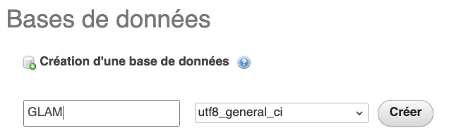
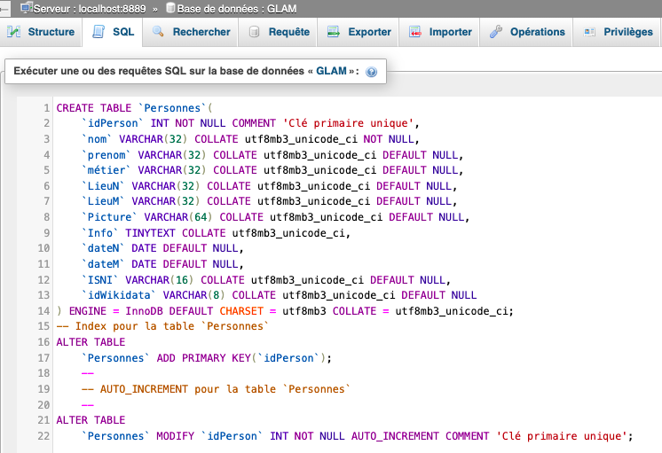

# Créer une base de données sur MAMP pour des personnes
Nous proposons de préparer une base de données et son contenu à partir du schéma de données Person de schema.org : [https://schema.org/Person](https://schema.org/Person).

Les données travaillées de manière collaboratives via Gsheet puis enrichies avec OpenRefine sont ici :  [https://docs.google.com/spreadsheets/d/e/2PACX-1vTm50gmXyXgIYkU9uRxy8y9BhNTzLq8cH9VrODf-UQRK-BUnEJNDiStTHv-_IC13lrxRwUgummQHBQN/pub?gid=221157170&single=true&output=csv](https://docs.google.com/spreadsheets/d/e/2PACX-1vTm50gmXyXgIYkU9uRxy8y9BhNTzLq8cH9VrODf-UQRK-BUnEJNDiStTHv-_IC13lrxRwUgummQHBQN/pub?gid=221157170&single=true&output=csv)

Elles sont prêtes à étre intégrées dans une base MySQL une fois intallé MAMP, via PHPmyAdmin : Voici le code SQL, également disponible [en fichier](https://github.com/geraldkembellec/master-ctm/blob/main/m2/Cre%CC%81erLaTablePersonnes.sql) la structure de la table. Il faut l'intégrer dans la base 'GLAM', **encodée en unicode utf8 case insensitive**, que vous allez créer via phpMyADMIN sur votre machine après avoir démarré MAMP.
On créé la base ...



... avec ce code SQL :

  ```SQL
    --
    -- Structure de la table `Personnes`
    --
    
    CREATE TABLE `Personnes` (
      `idPerson` int NOT NULL COMMENT 'Clé primaire unique',
      `nom` varchar(32) COLLATE utf8mb3_unicode_ci NOT NULL,
      `prenom` varchar(32) COLLATE utf8mb3_unicode_ci DEFAULT NULL,
      `métier` varchar(32) COLLATE utf8mb3_unicode_ci DEFAULT NULL,
      `LieuN` varchar(32) COLLATE utf8mb3_unicode_ci DEFAULT NULL,
      `LieuM` varchar(32) COLLATE utf8mb3_unicode_ci DEFAULT NULL,
      `Picture` varchar(64) COLLATE utf8mb3_unicode_ci DEFAULT NULL,
      `Info` tinytext COLLATE utf8mb3_unicode_ci,
      `dateN` date DEFAULT NULL,
      `dateM` date DEFAULT NULL,
      `ISNI` varchar(16) COLLATE utf8mb3_unicode_ci DEFAULT NULL,
      `idWikidata` varchar(8) COLLATE utf8mb3_unicode_ci DEFAULT NULL
    ) ENGINE=InnoDB DEFAULT CHARSET=utf8mb3 COLLATE=utf8mb3_unicode_ci;
    
    --
    -- Index pour la table `Personnes`
    --
    ALTER TABLE `Personnes`
      ADD PRIMARY KEY (`idPerson`);
    
    --
    -- AUTO_INCREMENT pour la table `Personnes`
    --
    ALTER TABLE `Personnes`
      MODIFY `idPerson` int NOT NULL AUTO_INCREMENT COMMENT 'Clé primaire unique';
    COMMIT;
    
  ```



Puis on importe les données du fichier CSV GoogleSheet :


Pour rappel, sur votre machine le répertoire des fichers HTML et PHP est C:\MAMP\htdocs sur windows et Applications/MAMP/htdocs)
